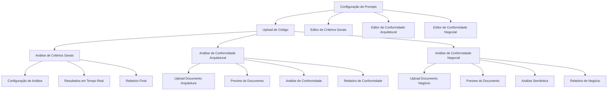
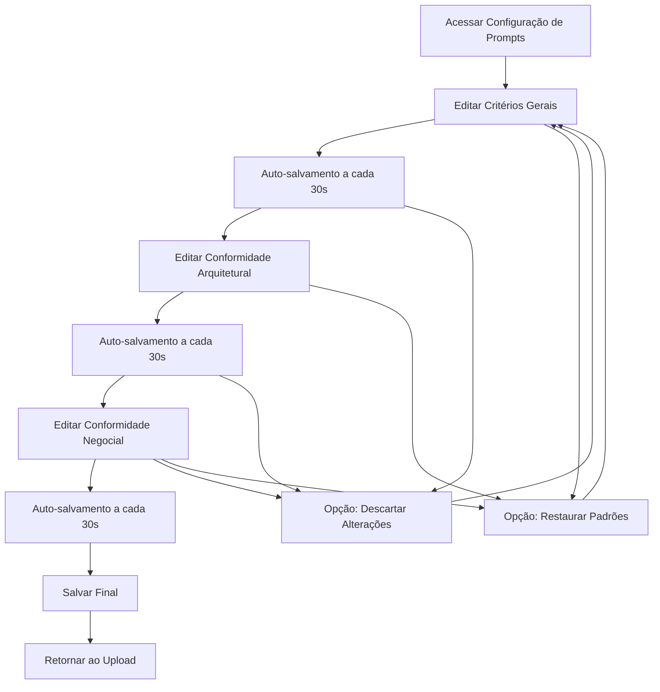
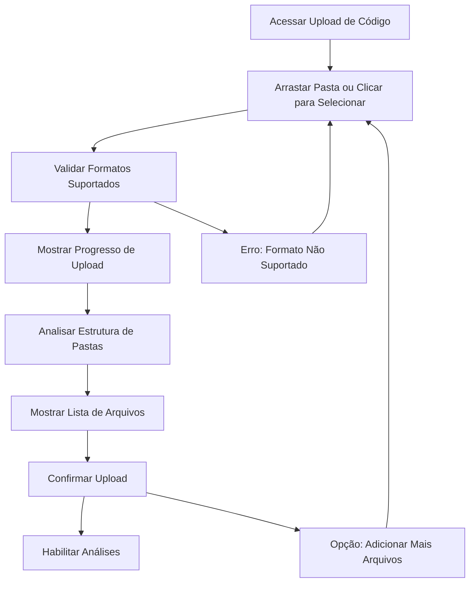
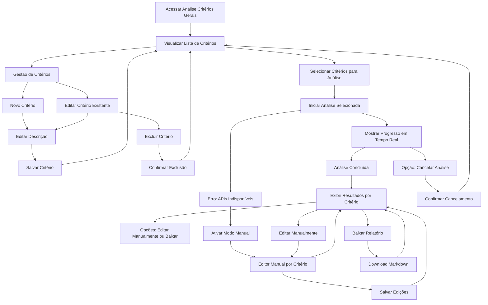
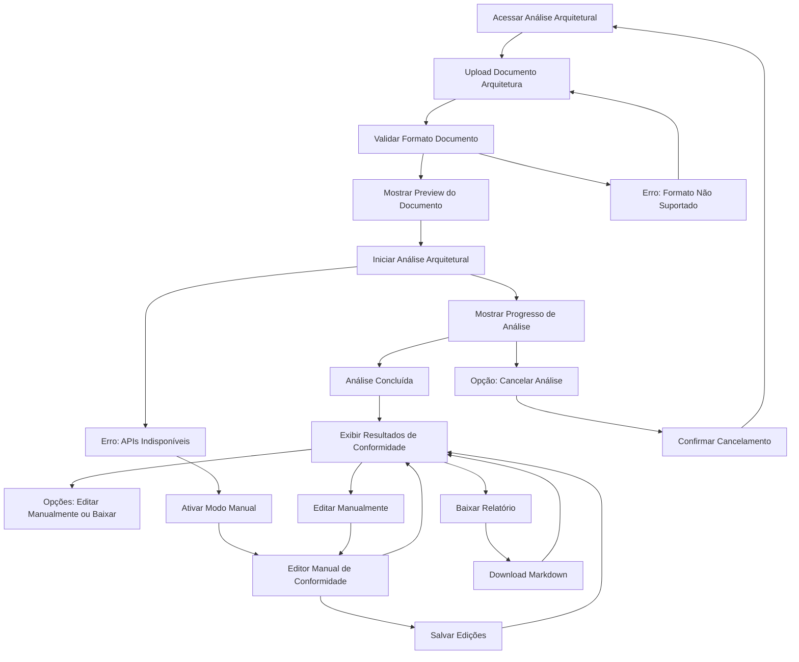
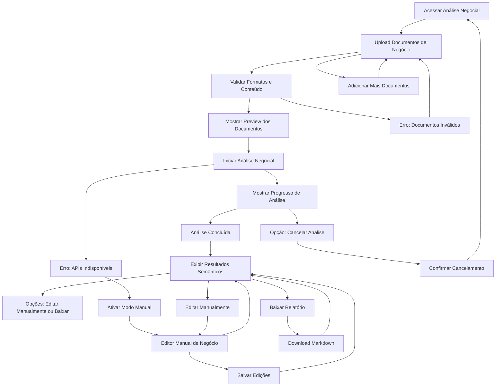

# VerificAI Code Quality System UI/UX Specification

*Documento em desenvolvimento - Modo Interativo*

---

## Introduction

This document defines the user experience goals, information architecture, user flows, and visual design specifications for **VerificAI Code Quality System**'s user interface. It serves as the foundation for visual design and frontend development, ensuring a cohesive and user-centered experience.

---

## Overall UX Goals & Principles

### Target User Personas

**Persona 1: QA Analyst (Usuário Principal)**
- Profissional de controle de qualidade em ambientes de desenvolvimento corporativos
- Necessita analisar código-fonte de forma eficiente para garantir conformidade
- Valoriza automação e redução de tarefas manuais repetitivas
- Familiarizado com conceitos técnicos mas pode não ser desenvolvedor

**Persona 2: Tech Lead (Usuário Secundário)**
- Líder técnico que supervisiona a qualidade do código
- Responsável por garantir conformidade arquitetural
- Necessita de visão holística da qualidade do projeto
- Interface de administração para configuração de prompts

**Persona 3: DevOps Engineer (Usuário Ocasional)**
- Gerencia o sistema e monitora métricas
- Configura integrações e resolve problemas técnicos
- Necessita de interface de administração e monitoramento

### Usability Goals

- **Eficiência de Análise:** Reduzir tempo de análise manual em 40% conforme PRD
- **Facilidade de Uso:** Novos usuários conseguem realizar análise completa em < 10 minutos
- **Prevenção de Erros:** Validações claras e confirmações para ações destrutivas
- **Consistência:** Interface previsível e padronizada seguindo Design System do governo

### Design Principles

1. **Clareza sobre Complexidade** - Interface limpa que oculta complexidade técnica quando não necessária
2. **Eficiência do Fluxo de Trabalho** - Minimizar cliques e navegação para tarefas frequentes
3. **Confiança Transparência** - Mostrar claramente o que o sistema está fazendo e por quê
4. **Acessibilidade Universal** - Design para todos os usuários desde o início (WCAG AA)
5. **Progresso Visível** - Indicadores claros de status e progresso durante análises

---

## Change Log

| Data | Versão | Descrição | Autor |
|------|--------|-----------|-------|
| 2025-09-14 | v1.0 | Criação inicial da especificação UI/UX | Sally (UX Expert) |

---

## Information Architecture (IA)

### Site Map / Screen Inventory

### Navigation Structure

**Primary Navigation:** Menu lateral fixo com ícones claros e nomenclatura consistente, seguindo padrões do Design System do governo. Navegação ordenada por fluxo lógico: Configuração → Upload → Análises.

**Secondary Navigation:** Abas horizontais dentro de cada tela principal para organizar sub-tarefas (ex: upload, configuração, resultados). Breadcrumb para mostrar contexto atual dentro do fluxo de análise.

**Breadcrumb Strategy:** `Configuração > Upload > Análise de Critérios Gerais > Resultados` - Mostra claramente a progressão do usuário no fluxo de trabalho, começando pela definição dos prompts que serão usados em todas as análises subsequentes.

---

## User Flows

### Flow 1: Configuração Inicial do Sistema

**User Goal:** Configurar os três tipos de prompts de análise que serão usados como base para todas as análises subsequentes

**Entry Points:** Tela inicial do sistema ou acesso via menu lateral

**Success Criteria:** Usuário consegue configurar e salvar todos os três prompts com syntax highlighting e autosalvamento funcional

#### Flow Diagram

#### Edge Cases & Error Handling:
- Conexão perdida durante edição: mostrar mensagem e tentar salvar quando conexão retornar
- Conteúdo muito grande: avisar sobre limites de tokens dos LLMs
- Sessão expirada: redirecionar para login com opção de recuperar conteúdo não salvo

**Notes:** Sistema deve manter versão anterior do prompt antes de cada alteração para permitir rollback

### Flow 2: Upload de Código-Fonte

**User Goal:** Fazer upload de pasta completa de código-fonte que será usado em todas as análises subsequentes

**Entry Points:** Após configuração de prompts ou via menu lateral (se já tiver código carregado anteriormente)

**Success Criteria:** Usuário consegue upload de pasta completa com visualização de progresso, lista de arquivos e confirmação de sucesso

#### Flow Diagram

#### Edge Cases & Error Handling:
- Pasta muito grande (>50MB): mostrar aviso e permitir seleção parcial
- Formatos de arquivo não suportados: listar formatos válidos e permitir filtragem
- Conexão interrompida: permitir retomar upload do ponto onde parou
- Arquivos duplicados: perguntar se deseja sobrescrever ou manter ambos

**Notes:** Sistema deve mostrar claramente todos os arquivos incluídos no upload para informação do usuário. Todos os arquivos serão automaticamente analisados com base nos critérios gerais, arquitetura e documentação negocial.

---

### Flow 3: Análise de Critérios Gerais

**User Goal:** Gerenciar lista de critérios de avaliação, selecionar critérios específicos para análise, executar avaliação e visualizar resultados

**Entry Points:** Tela de Análise de Critérios Gerais após upload de código

**Success Criteria:** Usuário consegue criar/editar/excluir critérios, selecionar quais analisar, executar análise e baixar relatório final

#### Flow Diagram

#### Edge Cases & Error Handling:
- APIs de IA indisponíveis: automaticamente oferecer modo manual com edição por critério
- Análise demorada (>10min): mostrar estimativa de tempo e permitir notificação quando concluída
- Lista vazia de critérios: mostrar mensagem para configurar critérios antes de analisar
- Resultados muito grandes: paginação ou sumário executivo com opção de detalhar por critério
- Erro durante análise: mostrar ponto de falha e permitir reiniciar a partir dali para critérios específicos

**Notes:** Sistema deve permitir gestão completa dos critérios (CRUD) e seleção individual ou coletiva para análise. Resultados devem ser exibidos organizados por critério avaliado, permitindo edição manual individual quando necessário.

### Flow 4: Análise de Conformidade Arquitetural

**User Goal:** Fazer upload de documento de arquitetura, verificar conformidade do código-fonte com a arquitetura definida e visualizar resultados

**Entry Points:** Tela de Análise de Conformidade Arquitetural após upload de código

**Success Criteria:** Usuário consegue upload documento, visualizar preview, executar análise de conformidade e baixar relatório

#### Flow Diagram

#### Edge Cases & Error Handling:
- Formatos de documento não suportados: listar formatos válidos (PDF, Markdown, DOCX)
- Documento muito grande: mostrar aviso e permitir otimização ou seleção de seções
- APIs de IA indisponíveis: automaticamente oferecer modo manual
- Análise demorada: mostrar estimativa de tempo baseada no tamanho do documento
- Erro de parsing: mostrar erro específico e permitir correção ou re-upload

**Notes:** Sistema deve usar o prompt de conformidade arquitetural configurado na tela de prompts para análise. Preview do documento deve permitir navegação básica antes da análise.

---

### Flow 5: Análise de Conformidade Negocial

**User Goal:** Fazer upload de documentos de negócio, verificar conformidade semântica do código-fonte com requisitos de negócio e visualizar resultados

**Entry Points:** Tela de Análise de Conformidade Negocial após upload de código

**Success Criteria:** Usuário consegue upload documentos, visualizar preview, executar análise semântica e baixar relatório

#### Flow Diagram

#### Edge Cases & Error Handling:
- Múltiplos documentos: permitir upload e organização de vários documentos de negócio
- Documentos conflitantes: identificar e alertar sobre contradições entre documentos
- Formatos variados: suportar histórias, épicos, regras de negócio em diferentes formatos
- Análise complexa: mostrar progresso detalhado quando processando múltiplos documentos
- Resultados ambíguos: destacar áreas que necessitam interpretação humana

**Notes:** Sistema deve usar o prompt de conformidade negocial configurado na tela de prompts. Análise semântica deve considerar relações entre diferentes documentos de negócio e seu impacto no código-fonte.

---

## Wireframes & Mockups

### Design Files Approach

**Design System:** Utilizar o padrão digital de governo denominado Design System publicado em https://www.gov.br/ds/home, incorporando paleta de cores, tipografia e componentes visuais consistentes com padrões governamentais brasileiros.

**Tool Recommendation:** Figma para criação de wireframes e mockups, permitindo colaboração em tempo real e prototipagem interativa.

---

### Key Screen Layouts

#### Screen 1: Configuração de Prompts

**Purpose:** Tela principal para configuração dos três tipos de prompts que servirão como base para todas as análises do sistema.

**Key Elements:**
- Área principal com três abas: Critérios Gerais, Conformidade Arquitetural, Conformidade Negocial
- Editor de texto com syntax highlighting para melhor visualização dos prompts
- Sistema de autosalvamento visual (indicador "Salvo às 14:30")
- Botões de ação: Salvar, Descartar Alterações, Restaurar Padrões
- Indicador visual de status (salvo/não salvo/erro)
- Histórico de versões recentes com opção de rollback

**Interaction Notes:** Interface com abas que permite alternar entre os três tipos de prompts. Mudanças não salvas geram alerta visual. Autosalvamento a cada 30 segundos com feedback não intrusivo.

**Design File Reference:** [Figma - Configuração de Prompts](link)

#### Screen 2: Upload de Código-Fonte

**Purpose:** Tela para upload de pastas completas de código-fonte que serão utilizadas em todas as análises subsequentes.

**Key Elements:**
- Área central de drag-and-drop com bordas tracejadas e ícone de upload
- Texto instrucional claro: "Arraste uma pasta de código ou clique para selecionar"
- Lista de arquivos após upload com informações (nome, tamanho, tipo)
- Indicador de progresso durante upload com porcentagem e tempo estimado
- Botão "Adicionar Mais Arquivos" para uploads complementares
- Mensagens de validação (formatos suportados, limite de 50MB)
- Status visual: "Pronto para análise" após upload concluído

**Interaction Notes:** Arrastar pasta diretamente na área ou click para navegação tradicional. Feedback visual imediato durante upload. Validação em tempo real de formatos e tamanhos.

**Design File Reference:** [Figma - Upload de Código](link)

#### Screen 3: Análise de Critérios Gerais

**Purpose:** Tela para gestão de critérios de avaliação, seleção para análise e visualização de resultados em formato tabular para fácil comparação.

**Key Elements:**
- Lista de critérios com checkbox para seleção individual ou "Selecionar Todos"
- Ações de CRUD: Novo Critério, Editar, Excluir com ícones intuitivos
- Modal para edição/criação de critérios com campo de descrição
- Botão principal "Iniciar Análise Selecionada" (habilitado apenas com critérios selecionados)
- Área de progresso durante análise com status detalhado
- Tabela de resultados com duas colunas principais:
  - **Coluna 1: Descrição do Critério** - Texto completo do critério avaliado
  - **Coluna 2: Resultado da Avaliação** - Resposta da IA com análise detalhada, cópia dos trechos encontrados que evidenciam o desacordo quando houver e a localização desse trecho com indicação do nome do arquivo
- Status visual para cada linha: ✅ Conforme, ⚠️ Parcialmente Conforme, ❌ Não Conforme
- Ações por linha: Editar Manualmente, Ver Detalhes
- Botão "Baixar Relatório Completo" acima da tabela
- Filtros e ordenação da tabela (por status, por data de análise)

**Interaction Notes:** Seleção múltipla com suporte a Ctrl+click. CRUD inline com modais de confirmação. Tabela com colunas redimensionáveis e scroll horizontal para conteúdo extenso. Clique em "Ver Detalhes" para expandir análise completa em modal. Edição manual por critério específico.

**Design File Reference:** [Figma - Análise de Critérios Gerais](link)

#### Screen 4: Análise de Conformidade Arquitetural

**Purpose:** Tela para upload de documento de arquitetura e análise de conformidade do código-fonte com a arquitetura definida.

**Key Elements:**
- Área de upload dedicada para documentos de arquitetura
- Preview do documento com navegação básica (scroll, zoom)
- Botão "Iniciar Análise de Conformidade" após upload
- Progresso de análise com indicação do documento sendo processado
- Resultados de conformidade com destaques para:
  - ✅ Conforme à arquitetura
  - ⚠️ Parcialmente conforme
  - ❌ Não conforme
- Exemplos de código específicos para cada ponto de não conformidade
- Opções de edição manual e download de relatório

**Interaction Notes:** Preview permite navegação básica antes da análise. Resultados mostram correlação direta entre requisitos arquiteturais e implementação no código. Destaques visuais claros para status de conformidade.

**Design File Reference:** [Figma - Análise Arquitetural](link)

#### Screen 5: Análise de Conformidade Negocial

**Purpose:** Tela para upload de documentos de negócio e análise semântica de conformidade do código-fonte com requisitos de negócio.

**Key Elements:**
- Área de upload para múltiplos documentos de negócio
- Organização visual dos documentos por tipo (histórias, épicos, regras)
- Preview individual de cada documento com navegação
- Botão "Iniciar Análise Semântica"
- Progresso detalhado mostrando processamento de cada documento
- Resultados agrupados por documento de negócio
- Destaque para mapeamento entre requisitos e implementação
- Alertas para conflitos ou ambiguidades identificadas
- Sistema de tags para categorização de achados

**Interaction Notes:** Suporte a múltiplos documentos com interface organizada. Análise considera relações entre diferentes documentos. Sistema inteligente de identificação de conflitos e ambiguidades.

**Design File Reference:** [Figma - Análise Negocial](link)

---

## Component Library / Design System

### Design System Approach

**Approach:** Utilizar o Design System do Governo Brasileiro (gov.br/ds) como base principal, criando uma biblioteca de componentes personalizada que atenda às necessidades específicas do VerificAI enquanto mantém consistência com padrões governamentais.

**Implementation Strategy:** Customização seletiva do Design System governamental para atender aos requisitos de análise de código e relatórios técnicos, mantendo acessibilidade e consistência visual.

---

### Core Components

#### Component 1: Editor de Prompts

**Purpose:** Editor de texto com syntax highlighting para configuração dos prompts de análise.

**Variants:**
- **Básico:** Campo de texto simples com syntax highlighting básico
- **Avançado:** Editor com linha numérica, autocomplete, e validação de sintaxe
- **Compacto:** Versão reduzida para modais e telas secundárias

**States:**
- **Default:** Editor pronto para edição
- **Focused:** Editor ativo com borda destacada
- **Saving:** Indicador de autosalvamento
- **Saved:** Feedback visual de sucesso
- **Error:** Indicação de erro na validação

**Usage Guidelines:** Usar sempre com label claro e tooltip de ajuda. Manter altura mínima de 200px para melhor usabilidade. Syntax highlighting deve destacar palavras-chave relacionadas a análise de código.

#### Component 2: Área de Upload

**Purpose:** Componente para upload de arquivos e pastas com drag-and-drop.

**Variants:**
- **Simples:** Upload único com botão tradicional
- **Drag-and-Drop:** Área ampla com suporte a arrastar arquivos
- **Múltiplo:** Suporte a seleção de múltiplos arquivos
- **Lista:** Combina upload com lista de arquivos já carregados

**States:**
- **Idle:** Área pronto para upload
- **Hover:** Destaque visual ao passar mouse
- **Dragging:** Destaque forte durante arraste de arquivos
- **Uploading:** Indicador de progresso
- **Success:** Feedback visual de upload concluído
- **Error:** Mensagem de erro específica

**Usage Guidelines:** Área mínima de 300x200px. Mostrar sempre formatos suportados e limites de tamanho. Feedback imediato para todas as interações.

#### Component 3: Tabela de Resultados

**Purpose:** Tabela especializada para exibição de critérios e resultados de análise.

**Variants:**
- **Compacta:** Sem colunas de ação, apenas visualização
- **Completa:** Com ações de edição e detalhes por linha
- **Filtrável:** Com controles de filtro e ordenação
- **Exportável:** Com opções de exportação dos dados

**States:**
- **Loading:** Indicador de carregamento de dados
- **Empty:** Mensagem quando não há resultados
- **Populated:** Tabela com dados completa
- **Error:** Estado de erro com mensagem de recuperação

**Usage Guidelines:** Colunas redimensionáveis. Suporte a scroll horizontal para conteúdo extenso. Status visual (✅⚠️❌) sempre visível. Ações por linha com ícones intuitivos.

#### Component 4: Indicador de Progresso

**Purpose:** Componente para mostrar progresso de análises e processamentos longos.

**Variants:**
- **Linear:** Barra de progresso horizontal com porcentagem
- **Circular:** Indicador circular para espaço reduzido
- **Detalhado:** Com etapas, tempo estimado e status atual
- **Step-by-Step:** Progresso dividido em etapas claras

**States:**
- **Idle:** Indicador pronto (0%)
- **In Progress:** Animação de progresso
- **Paused:** Progresso pausado com opção de retomar
- **Completed:** 100% com feedback de sucesso
- **Error:** Indicação de falha com opção de retry

**Usage Guidelines:** Mostrar sempre porcentagem e tempo estimado. Permitir cancelamento quando aplicável. Feedback não intrusivo para operações longas.

#### Component 5: Preview de Documentos

**Purpose:** Componente para preview de documentos antes da análise.

**Variants:**
- **Simples:** Preview básico com scroll
- **Navegável:** Com paginação e zoom
- **Comparativo:** Side-by-side para múltiplos documentos
- **Anotado:** Com destaques e marcações

**States:**
- **Loading:** Carregando documento
- **Ready:** Documento pronto para visualização
- **Error:** Falha ao carregar documento
- **Processing:** Documento sendo processado

**Usage Guidelines:** Manter proporções do documento original. Suporte a múltiplos formatos (PDF, Markdown, DOCX). Controles de navegação sempre visíveis.

---

## Branding & Style Guide

### Visual Identity

**Brand Guidelines:** Implementar o Design System do Governo Brasileiro (https://www.gov.br/ds/home) como base visual principal, adaptando para o contexto específico do VerificAI Code Quality System.

**Brand Adaptation:** Manter a identidade governamental enquanto adiciona elementos visuais que representam análise de código, qualidade e inteligência artificial.

---

### Color Palette

| Color Type | Hex Code | Usage |
|------------|----------|-------|
| **Primary** | #1351B4 | Botões primários, navegação ativa, elementos principais |
| **Secondary** | #00995D | Botões secundários, elementos de sucesso, confirmações |
| **Accent** | #FF6900 | Destaques, chamadas para ação, elementos importantes |
| **Success** | #00A859 | Feedback positivo, conformidade, operações bem-sucedidas |
| **Warning** | #F5C818 | Avisos, atenções, parcialmente conforme |
| **Error** | #D92B04 | Erros, não conformidade, ações destrutivas |
| **Neutral** | #202124 | Texto primário, bordas, elementos neutros |
| **Background** | #F5F5F5 | Fundos, áreas de conteúdo |
| **Surface** | #FFFFFF | Cards, modais, superfícies elevadas |

### Typography

#### Font Families
- **Primary:** Roboto (padrão do Design System governamental)
- **Secondary:** Source Code Pro (para código e trechos técnicos)
- **Monospace:** Roboto Mono (para caminhos de arquivos e comandos)

#### Type Scale

| Element | Size | Weight | Line Height |
|---------|------|--------|-------------|
| **H1** | 32px | 700 | 40px |
| **H2** | 28px | 600 | 36px |
| **H3** | 24px | 600 | 32px |
| **H4** | 20px | 500 | 28px |
| **Body** | 16px | 400 | 24px |
| **Small** | 14px | 400 | 20px |
| **Caption** | 12px | 400 | 16px |

### Iconography

**Icon Library:** Material Design Icons (compatível com Design System governamental)

**Usage Guidelines:**
- Usar ícones consistentes com 24px como tamanho padrão
- Manter contraste mínimo de 4.5:1 para acessibilidade
- Ícones devem ser auto-explicativos ou acompanhados de texto
- Usar variantes filled para ações primárias e outlined para secundárias

**Core Icons:**
- **upload:** CloudUpload para upload de arquivos
- **settings:** Settings para configuração
- **code:** Code para análise de código
- **architecture:** AccountTree para conformidade arquitetural
- **business:** BusinessCenter para análise negocial
- **check_circle:** CheckCircle para conformidade
- **error:** Error para não conformidade
- **warning:** Warning para alertas
- **edit:** Edit para ações de edição
- **download:** Download para exportação

### Spacing & Layout

**Grid System:** Sistema de grid de 8px baseado no Design System governamental

**Spacing Scale:**
- **Micro:** 4px - Espaçamentos mínimos entre elementos relacionados
- **Tiny:** 8px - Padding interno de componentes pequenos
- **Small:** 16px - Margens entre componentes relacionados
- **Medium:** 24px - Espaçamento entre seções
- **Large:** 32px - Margens principais de layout
- **XLarge:** 48px - Espaçamento entre áreas principais
- **XXLarge:** 64px - Espaçamento externo de containers

**Layout Principles:**
- **Consistência:** Manter alinhamento e espaçamento uniformes
- **Hierarquia:** Usar espaçamento para criar relações visuais claras
- **Respiração:** Deixar espaço adequado para conteúdo respirar
- **Responsividade:** Adaptar espaçamento para diferentes tamanhos de tela

---

## Responsiveness Strategy

### Breakpoints

| Breakpoint | Min Width | Max Width | Target Devices |
|------------|-----------|-----------|----------------|
| **Mobile** | 320px | 767px | Smartphones (modo paisagem) - *limitado conforme PRD* |
| **Tablet** | 768px | 1023px | iPad, Surface, tablets 10-11" |
| **Desktop** | 1024px | 1439px | Notebooks, desktops padrão |
| **Wide** | 1440px | - | Monitores grandes, ultra-wide |

**Note:** Conforme PRD, MVP foca em desktop e tablets, sem suporte para smartphones em modo retrato. Suporte básico para mobile landscape apenas para visualização.

### Adaptation Patterns

#### Layout Changes
- **Tablet (768px-1023px):** Menu lateral collapsible, redução de espaçamento em 25%, tabelas com scroll horizontal, botões e texto reduzidos em 10%
- **Desktop (1024px-1439px):** Layout completo com menu lateral fixo, espaçamento padrão, tabelas completas sem scroll
- **Wide (1440px+):** Aproveitamento de espaço extra com conteúdo mais espalhado, colunas adicionais onde aplicável, aumento máximo de largura de conteúdo

#### Navigation Changes
- **Tablet:** Menu lateral transforma-se em menu hamburger com overlay, navegação inferior fixa para acesso rápido
- **Desktop:** Menu lateral permanente com 5 opções principais, breadcrumb completo
- **Wide:** Menu lateral expandido com espaçamento adicional, possível submenu para itens secundários

#### Content Priority
- **Tablet:** Conteúdo essencial visível por padrão, detalhes em accordions ou modais, progresso de análise mais compacto
- **Desktop:** Todo conteúdo visível simultaneamente, progresso detalhado, tabelas completas
- **Wide:** Conteúdo adicional visível, múltiplas seções lado a lado, informações contextuais adicionais

#### Interaction Changes
- **Tablet:** Touch targets de 48px mínimo, gestos touch para navegação, feedback tátil
- **Desktop:** Hover states, cliques precisos, atalhos de teclado
- **Wide:** Interações adicionais como drag-and-drop avançado, multi-seleção avançada

---

### Device-Specific Considerations

#### Tablet Experience (Primary Mobile Support)
- **Orientation:** Suporte a portrait e landscape com layout adaptativo
- **Touch Interface:** Todos os elementos interativos com mínimo 48x48px
- **Screen Real Estate:** Menu compactável para maximizar área de conteúdo
- **Performance:** Otimizado para processadores móveis com lazy loading
- **Input:** Suporte a teclado virtual, seleção de texto touch-friendly

#### Desktop Experience (Primary Target)
- **Mouse/Keyboard:** Navegação completa por teclado, hover states detalhados
- **Screen Space:** Aproveitamento máximo do espaço disponível
- **Multi-tasking:** Suporte a janelas laterais, arrastar entre telas
- **Performance:** Renderização rápida, animações suaves
- **Advanced Features:** Todos os recursos disponíveis sem limitações

#### Wide Screen Experience
- **Content Density:** Opção de aumentar densidade de informação
- **Multi-column:** Layouts de múltiplas colunas onde aplicável
- **Advanced Views:** Visualizações simultâneas de diferentes seções
- **Productivity:** Recursos avançados de produtividade para usuários frequentes

---

### Performance Considerations

- **Mobile First:** Desenvolver para tablet primeiro, depois progressive enhancement para desktop
- **Image Optimization:** Imagens responsive e lazy loading
- **Font Loading:** Estratégia de font loading otimizada para diferentes dispositivos
- **Interaction Delay:** Máximo 100ms para feedback visual em todas as interações
- **Animation Performance:** 60fps mínimo para todas as animações

---

## Animation & Micro-interactions

### Motion Principles

**Purpose:** Animações e micro-interações devem melhorar a usabilidade, fornecer feedback claro e guiar o usuário, nunca distrair ou causar confusão.

**Core Principles:**
1. **Purposeful** - Toda animação tem um objetivo funcional claro
2. **Subtle** - Animações suaves que não chamam atenção desnecessariamente
3. **Consistent** - Padrões de movimento consistentes em todo o sistema
4. **Performant** - 60fps mínimo, otimizadas para todos os dispositivos
5. **Accessible** - Opção de reduzir movimento para usuários sensíveis

---

### Key Animations

#### Upload Interactions
- **File Drop Animation:** Suave expansão da área de upload quando arquivo é arrastado sobre ela (300ms ease-out)
- **Progress Animation:** Barra de progresso fluida com porcentagem animada, efeito de preenchimento orgânico
- **Success Feedback:** Checkmark animado com leve bounce (200ms) + confete sutil para uploads bem-sucedidos
- **Error Feedback:** Shake animation suave (300ms) + mudança de cor para estados de erro

#### Editor de Prompts
- **Auto-save Animation:** Indicador circular rotativo (1s) + "Salvo às 14:30" fade-in (200ms)
- **Syntax Highlighting:** Colorização suave ao digitar, sem delays perceptíveis
- **Focus Transition:** Borda suave expanding quando editor ganha foco (200ms ease-out)
- **Content Change:** Leve pulsação no botão salvar quando há alterações não salvas

#### Tabela de Resultados
- **Row Hover:** Background color change suave (150ms) + opção de ação fade-in
- **Status Update:** Status indicators (✅⚠️❌) com scale-in animation (200ms bounce)
- **Filter Application:** Transição suave entre estados filtrados (300ms fade)
- **Sort Animation:** Reordenação fluida das linhas quando ordenação muda

#### Navigation & Menus
- **Menu Toggle:** Slide-in suave do menu lateral (250ms ease-in-out)
- **Active State:** Subtle underline animation para itens ativos (200ms)
- **Breadcrumb Navigation:** Each breadcrumb item com hover effect suave
- **Tab Switching:** Content fade-between em mudanças de aba (200ms)

---

### Animation Timing & Easing

#### Timing Guidelines
- **Fast:** 150-200ms - Feedback imediato, hover states, toggle switches
- **Medium:** 200-300ms - Content transitions, modal opens, progress updates
- **Slow:** 300-400ms - Complex state changes, page transitions, major updates

#### Easing Functions
- **Ease-out:** Para animações que aparecem (suave início, rápido fim)
- **Ease-in:** Para animações que desaparecem (rápido início, suave fim)
- **Ease-in-out:** Para transições complexas e movimentos naturais
- **Linear:** Para progress bars e animações de timing preciso

#### Performance Considerations
- **GPU Acceleration:** Usar transform e opacity para melhor performance
- **Reduce Motion:** Respeitar prefers-reduced-motion media query
- **Animation Suspension:** Pausar animações em background tabs
- **Progressive Enhancement:** Animações não devem bloquear funcionalidade

---

### Micro-interaction Details

#### Button Interactions
- **Hover:** Scale 1.05 + shadow sutil (100ms)
- **Active:** Scale 0.95 + feedback tátil em tablets (50ms)
- **Loading:** Spinner animation + estado desabilitado
- **Success:** Checkmark animado + cor de fundo temporária

#### Form Interactions
- **Input Focus:** Border color change + label move-up (200ms)
- **Validation Error:** Shake animation + error message fade-in (300ms)
- **Character Count:** Smooth counter animation ao digitar
- **Dropdown Opening:** Scale-y transform origin top (200ms)

#### Loading States
- **Skeleton Loading:** Pulse effect em áreas de conteúdo carregando
- **Progress Indicators:** Circular ou linear com movimento fluido
- **Content Reveal:** Fade-up animation para conteúdo carregado
- **Error Recovery:** Smooth transition entre erro e retry states

#### Feedback Loops
- **Action Confirmation:** Toast notification com auto-dismiss (3s)
- **Success States:** Color change temporária + checkmark
- **Error Recovery:** Clear indication + retry option
- **Progress Updates:** Real-time feedback com smooth transitions

---

## Performance Considerations

### Performance Goals

- **Page Load:** Tempo máximo de 3s para carregamento inicial da aplicação, 1s para navegação entre telas
- **Interaction Response:** Máximo 100ms para feedback visual em todas as interações do usuário
- **Animation FPS:** 60fps mínimo para todas as animações e transições
- **Memory Usage:** Manter uso de memória abaixo de 100MB para operações normais
- **Bundle Size:** JavaScript bundle inicial abaixo de 500KB comprimido

---

### Design Strategies

#### Lazy Loading
- **Code Splitting:** Dividir a aplicação por rotas principais (5 telas principais)
- **Component Lazy Loading:** Carregar componentes pesados apenas quando necessários
- **Image Loading:** Lazy loading para todas as imagens e documentos preview
- **Feature Flagging:** Carregar funcionalidades avançadas sob demanda

#### Caching Strategy
- **Static Assets:** Cache de 1 ano para arquivos estáticos com fingerprinting
- **API Responses:** Cache agressivo para respostas de configuração e prompts
- **Document Previews:** Cache de previews de documentos já processados
- **Analysis Results:** Cache temporário de resultados de análise recente

#### Optimization Techniques
- **Virtualization:** Virtual scrolling para tabelas grandes de resultados
- **Debouncing:** Debounce para operações de salvamento automático e search
- **Progressive Loading:** Carregar conteúdo em chunks para melhor perceived performance
- **Optimized Images:** WebP format, responsive images, appropriate sizing

---

### Technical Considerations

#### Bundle Optimization
- **Tree Shaking:** Remover código não utilizado durante build
- **Code Minification:** Minificação de JavaScript, CSS e HTML
- **Compression:** Gzip/Brotli compression para todos os assets
- **Critical CSS:** Inline CSS crítico para above-the-fold content

#### Rendering Performance
- **DOM Optimization:** Minimize DOM manipulations e reflows
- **CSS Containment:** Use contain para limitar scope de recalculos
- **Will-change:** Use judiciosamente para otimizar animações
- ** RAF Animation:** Use requestAnimationFrame para animações smooth

#### Memory Management
- **Event Listener Cleanup:** Remover event listeners quando não necessários
- **Large Object Handling:** Gerenciar cuidadosamente objetos grandes (documentos, resultados)
- **Memory Leaks Prevention:** Regular memory profiling e cleanup
- **Garbage Collection:** Encourage garbage collection em momentos apropriados

---

### Monitoring & Metrics

#### Key Performance Indicators
- **LCP (Largest Contentful Paint):** < 2.5s
- **FID (First Input Delay):** < 100ms
- **CLS (Cumulative Layout Shift):** < 0.1
- **FCP (First Contentful Paint):** < 1.8s
- **TTFB (Time to First Byte):** < 600ms

#### Real User Monitoring
- **Performance Tracking:** Monitorar métricas reais de usuários
- **Error Tracking:** Monitorar erros de JavaScript e falhas de carregamento
- **User Experience:** Rastrear interações e tempos de resposta
- **Device Segmentation:** Analisar performance por dispositivo e conexão

#### Performance Budgets
- **Bundle Size Budget:** 500KB inicial, 1MB total
- **Image Budget:** 1MB máximo por página
- **Request Count:** Máximo 50 requests por página
- **Load Time Budget:** 3s para 3G connection

---

### User Experience Considerations

#### Loading States
- **Skeleton Screens:** Mostrar estrutura de conteúdo durante carregamento
- **Progressive Loading:** Carregar conteúdo em prioridade
- **Loading Indicators:** Feedback claro durante operações assíncronas
- **Offline Support:** Indicação clara quando offline + retry strategies

#### Error Handling
- **Graceful Degradation:** Funcionalidade básica mantida quando features falham
- **Error Boundaries:** Prevenir que erros quebrem a aplicação inteira
- **User Feedback:** Mensagens de erro claras e acionáveis
- **Recovery Options:** Opções claras para recuperação de erros

#### Network Conditions
- **Offline Support:** Service worker para operações básicas offline
- **Slow Connection:** Otimizações para conexões 2G/3G
- **Data Saver:** Respeitar preferências de economia de dados
- **Connection Awareness:** Adaptar experiência baseado na qualidade da conexão

---

## Next Steps

### Immediate Actions

1. **Finalizar documentação UI/UX** - Revisar e validar todas as seções com stakeholders
2. **Criar wireframes no Figma** - Desenvolver wireframes de baixa fidelidade para as 5 telas principais
3. **Validar com usuários QA** - Realizar sessões de feedback com analistas de QA para validar fluxos
4. **Aprovar Design System** - Confirmar adaptações do Design System governamental com equipe de design
5. **Preparar handoff técnico** - Documentar especificações para equipe de desenvolvimento frontend

### Design Handoff Checklist

#### Pré-requisitos para Desenvolvimento
- [ ] Todas as 5 telas principais com wireframes aprovados
- [ ] Component library detalhada com estados e variantes
- [ ] Especificações de responsividade para tablet e desktop
- [ ] Documentação de acessibilidade WCAG 2.1 AA validada
- [ ] Performance budgets e métricas definidas
- [ ] Guia de branding e style guide finalizado

#### Artefatos para Entrega
- [ ] Figma file com todos os componentes e telas
- [ ] Especificações técnicas em Markdown (este documento)
- [ ] Assets de design (ícones, imagens, cores)
- [ ] Protótipos interativos dos fluxos principais
- [ ] Documentação de animações e micro-interações
- [ ] Checklist de validação de acessibilidade

### Roadmap de Implementação

#### Fase 1: Foundation (Semanas 1-2)
- Setup do projeto e configuração do Design System
- Implementação dos componentes base e layout principal
- Menu de navegação e estrutura das 5 telas

#### Fase 2: Core Features (Semanas 3-4)
- Tela de Configuração de Prompts com editor de texto
- Tela de Upload de Código com drag-and-drop
- Sistema de routing e navegação entre telas

#### Fase 3: Analysis Features (Semanas 5-6)
- Tela de Análise de Critérios Gerais com CRUD e tabela de resultados
- Integração com backend para processamento de análises
- Sistema de exibição de resultados e relatórios

#### Fase 4: Document Analysis (Semanas 7-8)
- Tela de Análise de Conformidade Arquitetural
- Tela de Análise de Conformidade Negocial
- Preview de documentos e upload de arquivos

#### Fase 5: Polish & Testing (Semanas 9-10)
- Implementação de animações e micro-interações
- Otimizações de performance e responsividade
- Testes de acessibilidade e validação final

### Próximos Passos para Outras Equipes

#### Para Equipe de Backend
- Integrar com as APIs de processamento de análise
- Implementar endpoints para upload de arquivos e documentos
- Desenvolver sistema de fila para processamento assíncrono
- Configurar integração com provedores de LLM

#### Para Equipe de QA
- Preparar casos de teste baseados nos fluxos documentados
- Validar acessibilidade em todas as telas e componentes
- Testar performance nos diferentes dispositivos e conexões
- Verificar conformidade com Design System governamental

#### Para Equipe de DevOps
- Configurar pipeline de CI/CD com validações de qualidade
- Implementar monitoramento de performance e erros
- Preparar ambiente de staging para validação
- Configurar deploy automatizado para produção

### Considerações Finais

Esta especificação UI/UX fornece uma base completa e detalhada para o desenvolvimento do VerificAI Code Quality System, cobrindo:

- **User Experience:** Fluxos otimizados para equipes de QA
- **Interface Design:** Componentes consistentes baseados em padrões governamentais
- **Accessibility:** WCAG 2.1 Level AA compliance
- **Performance:** Metas claras e estratégias de otimização
- **Technical Implementation:** Especificações detalhadas para desenvolvimento

O sistema está pronto para avançar para a fase de design visual e desenvolvimento frontend, com todos os princípios e diretrizes necessários para criar uma experiência de usuário excepcional.

---

**Status da Documentação:** ✅ **COMPLETA**

**Versão:** v1.0
**Data:** 2025-09-14
**Autor:** Sally (UX Expert)
**Revisores:** Pendente validação com stakeholders

---

## Documento Relacionado

Este documento UI/UX servirá como base para o **Architecture Document** que definirá a implementação técnica do sistema, incluindo integração com backend, APIs, estrutura de componentes e estratégias de desenvolvimento.